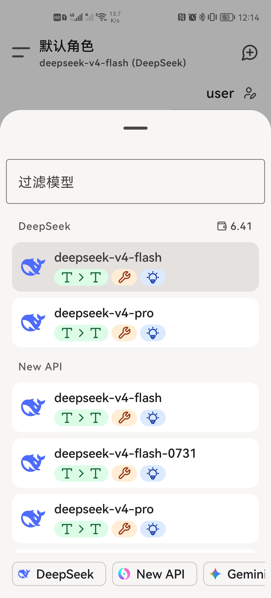
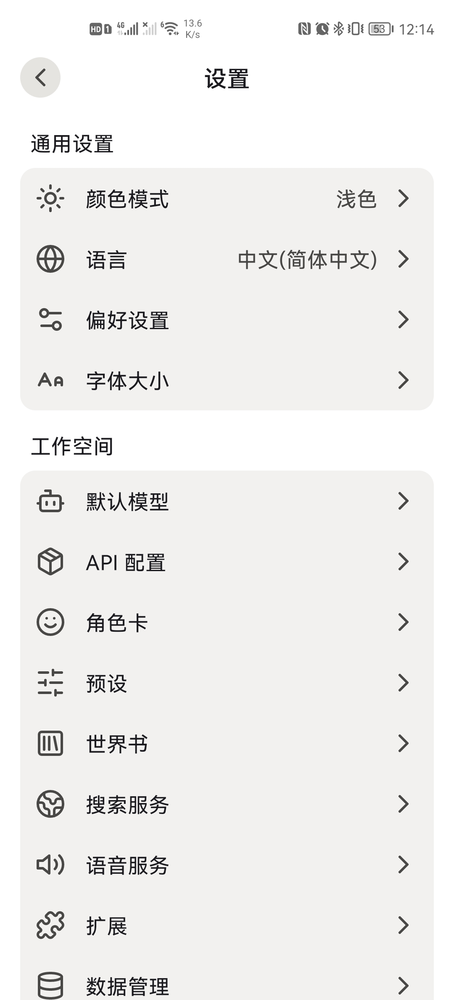

<div align="center">
  
  <h1>FawnTavern</h1>
  <p>轻量、现代的 Android AI 角色扮演聊天客户端</p>

  <p><strong>简体中文</strong> | <a href="./README.en.md">English</a></p>

  <p>
    
    
  </p>
</div>

FawnTavern 是一款轻量的 AI 角色扮演聊天客户端。支持导入 SillyTavern 兼容的角色卡、预设和世界书，可连接多种大模型 API，随时随地与喜欢的角色聊天。

## 截图

<div align="center">
  
  
  
</div>

## 主要功能

- 导入和管理 SillyTavern 兼容的角色卡、预设与世界书
- 对接多种大模型服务以及 OpenAI 兼容接口
- 支持流式回复、消息编辑、重新生成和多版本切换
- 支持联网搜索、文本朗读、图片与文件附件
- 支持自定义提示词、快捷回复和聊天界面设置
- 聊天记录、角色数据和配置保存在本地
- 支持本地备份、恢复与应用内更新检查

## 下载

前往 [GitHub Releases](https://github.com/weiruchenai1/fawntavern/releases) 下载最新版本。

| 安装包 | 适用设备 |
| --- | --- |
| `FawnTavern-<版本号>-arm64-v8a.apk` | 绝大多数现代 Android 手机和平板 |
| `FawnTavern-<版本号>-x86_64.apk` | x86_64 Android 模拟器和部分 Chromebook |

普通手机通常选择 `arm64-v8a`。应用不提供来自第三方下载站的安装包，请核对 Release 页面中的 SHA-256 校验文件。

## 系统要求

- Android 8.0（API 26）或更高版本
- `arm64-v8a` 或 `x86_64` 设备
- 使用在线模型、联网搜索和更新检查时需要网络连接
- FawnTavern 本身不提供大模型额度，需要使用你自己的 API 服务

## 隐私与数据

- 聊天记录、角色卡、预设、世界书和附件默认保存在设备本地。
- API、搜索和 TTS 凭据使用 Android Keystore 保护的 AES-GCM 密钥加密。
- 模型请求会发送到你配置的 API 服务商，请同时阅读对应服务商的隐私政策。

## 信息收集披露

FawnTavern 没有自建服务端，聊天记录、角色卡、预设、世界书和附件默认只保存在设备本地。除下列情况外，应用不会收集或上传任何数据：

- **模型服务**：聊天内容会发送到你自行配置的模型 API 服务商，由其处理，请同时阅读对应服务商的隐私政策。
- **联网搜索**：开启联网搜索后，搜索关键词会发送到你配置的搜索服务商。
- **远程诊断（默认开启，可在设置中关闭）**：为改进稳定性，应用按所在地区通过腾讯 Bugly（中国大陆）或 Google Firebase（其他地区）收集崩溃日志与应用启动事件（含崩溃堆栈、构建类型与版本号），并会访问 Cloudflare 接口确定所在地区以选择诊断服务，结果缓存 24 小时。Bugly 不采集设备标识与隐私信息。在设置中关闭后不会上传任何诊断数据。
- **版本更新检查**：检查更新时仅向 GitHub Releases API 请求最新版本信息并附带设备 CPU 架构以匹配安装包，不包含个人数据。

## 免责声明

本应用仅供学习和娱乐用途。AI 生成的内容不代表开发者立场，请合理使用。使用第三方模型、搜索或语音服务时，应遵守相应服务商的使用条款以及所在地法律法规。

## 开发

开发环境需要 JDK 17，以及支持 `compileSdk 37` 的 Android SDK。

```powershell
git clone https://github.com/weiruchenai1/fawntavern.git
cd fawntavern
.\gradlew.bat assembleDebug
```

## 许可证

本项目使用 [AGPL-3.0](./LICENSE) 许可证。

## 致谢

- [SillyTavern](https://github.com/SillyTavern/SillyTavern)

本项目在编写时也参考了其他的开源项目，特别感谢以下项目：

- [RikkaHub](https://github.com/rikkahub/rikkahub)
- [Kelivo](https://github.com/Chevey339/kelivo)
